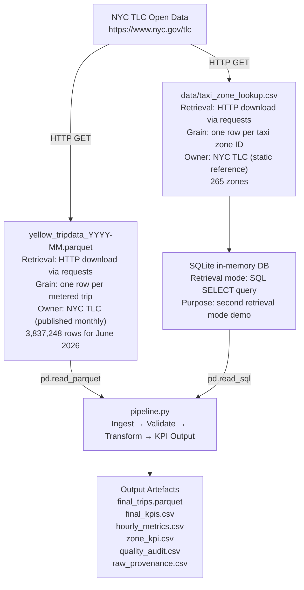
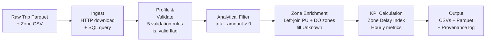
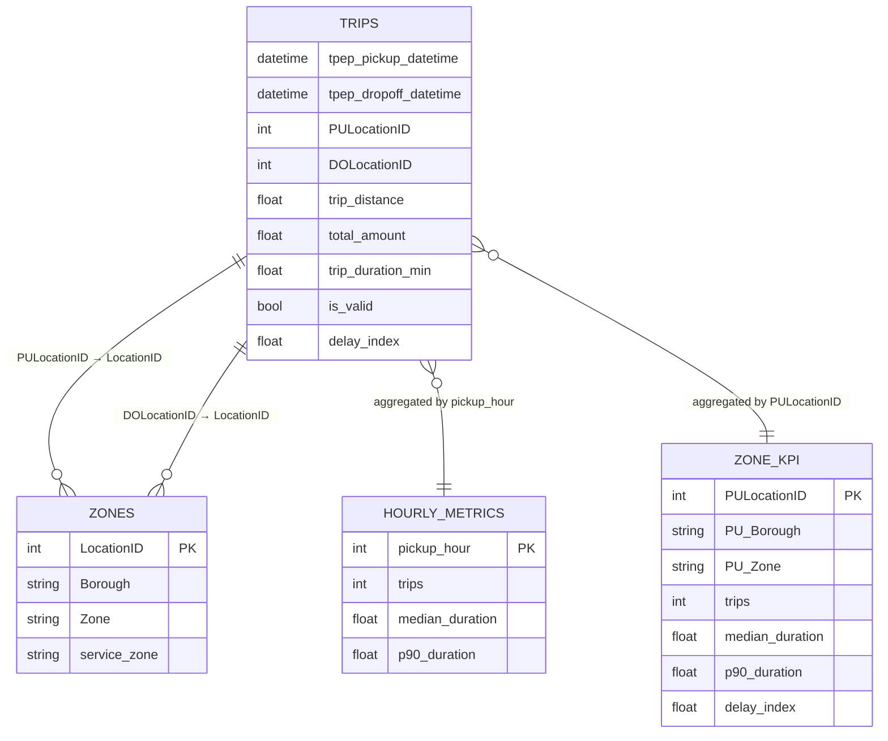
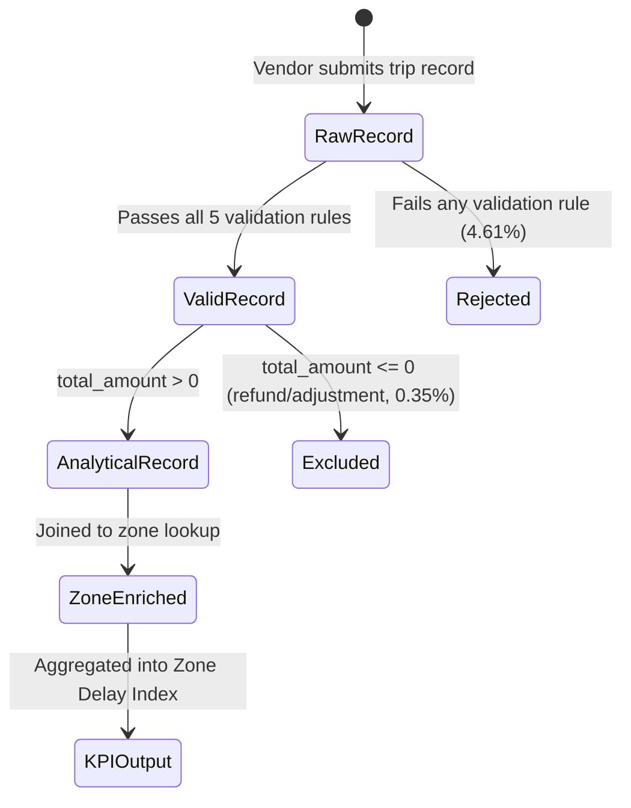

# NYC TLC Yellow Taxi — Zone Trip Duration Delay Analysis

**FDE Data Foundations Assignment 2 | Track B — NYC TLC**

---

## Business Question

> **Which NYC yellow-taxi pickup zones consistently produce longer-than-baseline trip durations, and how severe is the difference relative to the citywide non-airport baseline?**

---

## Users / Stakeholders

| Stakeholder | Interest |
|---|---|
| NYC Taxi & Limousine Commission (TLC) — Operations & Planning | Identifying pickup zones that may warrant further investigation or attention |
| TLC Analytics / Data Governance team | Confirming that the monthly trip dataset meets quality standards before operational use |

---

## Decision Supported

> **Identify pickup zones that warrant further operational investigation based on unusually high trip-duration delay relative to the citywide non-airport baseline.**

This pipeline does **not** claim to diagnose *why* a zone is delayed, nor does it prescribe a specific intervention. It produces a ranked, evidence-based signal for further investigation.

---

## Project KPI

**Zone Delay Index**

```
Zone Delay Index = zone median trip duration (min)
                  ──────────────────────────────────────────────
                  citywide non-airport median trip duration (min)
```

- A value of **1.0** means the zone's median trip duration equals the citywide non-airport norm
- A value of **2.0** means trips from that zone take twice as long as the citywide norm, on average
- Airport zones (JFK, LaGuardia, Newark) are excluded from the baseline and the zone ranking because they represent a categorically different trip type (long-haul, fixed-route)

---

## Final Evidence Table

*Based on June 2026 NYC TLC Yellow Taxi data — 3,647,543 analytical trips*

| # | Metric | Value | Purpose |
|---|---|---|---|
| 1 | **Core Valid Trip Rate** | 95.39% | Data quality gate — confirms pipeline output is trustworthy |
| 2 | **Citywide Non-Airport Median Trip Duration** | 13.60 min | Baseline denominator for the Zone Delay Index |
| 3 | **Zone Delay Index — Highest zone (East Elmhurst)** | **2.36×** | Primary KPI: median duration 32.13 min vs. 13.60 min baseline |
| 4 | **Zone P90 Trip Duration — East Elmhurst** | 56.11 min | Tail severity: worst-decile rider experience in the highest-delay zone |
| 5 | **Peak Demand Hour / Peak Hour Trips** | 18:00 / 231,529 trips | Operational context: flags the hour when demand pressure is highest |

*Full zone rankings available in `zone_kpi.csv` (79 qualifying zones with ≥ 3,000 trips each for June 2026)*

---

## Source Overview

### Source Map



### Source Details

| Source | Owner | Grain | Format | Key Fields | Retrieval Mode |
|---|---|---|---|---|---|
| NYC TLC Yellow Trip Data (monthly) | NYC TLC (public) | 1 row = 1 metered trip | Parquet | pickup/dropoff datetime, location IDs, distance, fare/total amount | HTTP download (requests) |
| NYC TLC Taxi Zone Lookup | NYC TLC (public, static) | 1 row = 1 zone ID | CSV → SQLite | LocationID, Borough, Zone, service_zone | SQL query (sqlite3 in-memory via data/taxi_zone_lookup.csv) |

### Important Source Gaps

- No real-time or near-real-time availability — data is published ~2 months after the trip month
- No driver or vehicle identifiers — cannot attribute patterns to individual drivers or fleets
- No weather, events, or road-condition data — cannot explain *why* a zone has higher delay
- No demand-side data — riders who could not get a taxi are invisible in this dataset

---

## Workflow and Data Model

### Pipeline Workflow



### Data Model (Entity Relationships)



### Trip Lifecycle (Event Model)



---

## Validation Rules

| # | Rule | Logic | Rationale |
|---|---|---|---|
| 1 | Valid pickup date | Pickup within `[month start, month end)` | Exclude stale or misrouted records from other months |
| 2 | Valid timestamp order | Dropoff > Pickup | Negative or zero duration is physically impossible for a completed trip |
| 3 | Valid distance | `trip_distance > 0` | A recorded trip must cover some distance |
| 4 | Valid pickup zone | `PULocationID` in zone lookup | Required for zone enrichment and delay index calculation |
| 5 | Valid dropoff zone | `DOLocationID` in zone lookup | Required for complete trip spatial attribution |

**Combined**: all five rules must be True → `is_valid = True`

**Additional analytical filter**: `total_amount > 0` — removes 12,932 records interpreted as refund or adjustment entries. Applied after core validation.

---

## Known / Unknown / Assumption / Limitation (KUAL)

### Known

- **4.61% of raw records fail core validation** (176,773 rows). Individual rule failure counts for June 2026: zero or negative trip distance (128,106 failures — largest single category), non-positive duration / dropoff not after pickup (49,807), and pickup dates outside the target month (17). A single record can fail multiple rules simultaneously; the combined `is_valid` failure count (176,773) reflects rows failing any rule. All failures are flagged explicitly, not silently dropped.
- **3,654 pickup zones and 3,389 drop-off zones remain "Unknown"** after zone enrichment. These trips passed validation (PULocationID is in the zone lookup) but the lookup entry itself has no Borough or Zone name (LocationID 264 = "N/A"). They are retained in the analytical dataset but excluded from zone KPI rankings.
- **12,932 records with `total_amount <= 0`** are removed as a secondary analytical filter. These are interpreted as vendor-issued refunds or billing adjustments. They are logged in `quality_audit.csv`.
- **Zone KPI rankings only include zones with ≥ 3,000 trips** in the month. This threshold excludes low-volume zones where the median is statistically unreliable.

### Unknown

- **Why East Elmhurst (2.36×) and the other high-delay zones have elevated durations.** The data cannot distinguish between traffic congestion, trip-type composition (longer routes), driver behaviour, or infrastructure factors.
- **Whether June 2026 delay patterns are typical.** A single month provides no seasonality or trend context.
- **Whether high delay at a zone is driven by conditions at pickup or during transit.** Only pickup zone is available as the spatial grouper; the full route is not recorded.
- **Demand suppression.** Riders who attempted but failed to get a taxi at a high-delay zone are invisible in this dataset.

### Assumptions

- **`total_amount > 0` is a reliable proxy for excluding refund/adjustment records.** It is possible that some legitimate low-cost trips are excluded. However, the `total_amount` field reflects the full economic value of a trip including all surcharges; a positive total is a necessary condition for a genuine completed trip in the operational sense.
- **The non-airport median (13.60 min) is an appropriate citywide baseline.** Airport zones (JFK, LaGuardia, Newark) are excluded because they represent fixed long-haul routes that would artificially inflate the baseline and suppress the signal for delay in urban zones.
- **Zones with ≥ 3,000 trips in a single month are large enough to produce a stable median.** The 3,000-trip threshold is an operational choice, not a statistical guarantee.
- **The zone lookup table is authoritative and complete for NYC yellow taxi zones.** Two entries (LocationID 264, 265) have no usable metadata; this is treated as a known data gap, not a pipeline failure.
- **Missing `passenger_count`, `RatecodeID`, `store_and_fwd_flag`, `congestion_surcharge`, and `Airport_fee` values** (present in ~26% of records, tied to specific VendorIDs) do not affect trip validity for the purposes of this analysis. These fields are not used in the Zone Delay Index calculation.

### Limitations

- **Single month of data (June 2026)** — results cannot be generalised across seasons, years, or special events.
- **Trip duration is a proxy, not a direct delay measure.** Duration conflates distance, speed, and routing. A zone with many long-distance trips will show high median duration regardless of congestion.
- **The Zone Delay Index is a relative, not an absolute measure.** A zone at 2.36× is flagged for investigation, but the index does not indicate what the "correct" duration should be.
- **No causal inference is possible** from this analysis. The output is a prioritisation signal, not an explanation.

---

## Repository Structure

```
FDE-ASST2/
├── README.md                     ← Main documentation
├── requirements.txt              ← Python dependencies for pipeline.py
├── pipeline.py                   ← Standalone runnable pipeline
├── .gitignore                    ← Git exclusion rules for raw data & outputs
│
├── notebooks/
│   └── NYC_TLC_Analysis.ipynb    ← Exploratory notebook (EDA + development)
│
├── data/
│   └── taxi_zone_lookup.csv      ← Zone reference data (static input, committed)
│
├── outputs/                      ← Pre-computed June 2026 results (committed)
│   ├── final_kpis.csv
│   ├── hourly_metrics.csv
│   ├── zone_kpi.csv
│   └── quality_audit.csv
│
└── [not committed to GitHub]
    ├── final_trips.parquet       ← Large enriched dataset (~88 MB) — generated by pipeline
    └── raw/yellow_tripdata_*.parquet ← Raw TLC source file — downloaded by pipeline
```

> **Note on large files**: `final_trips.parquet` and the raw TLC parquet are not committed to the repository due to size. The pipeline downloads the raw TLC file automatically and regenerates all outputs from scratch.

---

## Setup and Run Instructions

### Requirements

```bash
pip install -r requirements.txt
```

> **Note on notebook vs. pipeline outputs**: The exploratory notebook (`notebooks/NYC_TLC_Analysis.ipynb`) was developed iteratively and produces 10 summary metrics. The standalone `pipeline.py` produces 11 metrics — it adds `Citywide Non-Airport Median Duration` as an explicit row because it is the denominator of the Zone Delay Index and should be surfaced clearly in the output. The validation logic, thresholds, and final analytical row counts are identical between the two.

### Run the pipeline

```bash
# Default: June 2026
python pipeline.py

# Specify a different month
python pipeline.py --year 2026 --month 7

# Skip re-download if raw files already exist locally
python pipeline.py --year 2026 --month 6 --skip-download

# Custom output directory
python pipeline.py --year 2026 --month 6 --output-dir ./results/june-2026
```

### What the pipeline does (in order)

1. **Retrieves** the trip Parquet file via HTTP download from the TLC public endpoint (retrieval mode 1)
2. **Retrieves** the zone lookup CSV via HTTP download, then loads it into an in-memory SQLite database and queries it with SQL (retrieval mode 2)
3. **Checks retrieval completeness**: asserts the file covers the target month and is non-empty
4. **Preserves raw inputs**: writes SHA-256 digests of downloaded source files to `raw_provenance.csv` (written only when files are downloaded; skipped with `--skip-download`)
5. **Validates**: applies 5 business-oriented validation rules and logs failure counts per rule
6. **Filters**: removes `total_amount <= 0` records as a secondary analytical filter
7. **Enriches**: joins pickup and drop-off zone metadata; fills unmatched zones as `"Unknown"`
8. **Calculates metrics**: Zone Delay Index, hourly metrics, summary KPIs, quality audit
9. **Asserts integrity**: 7 pipeline assertions with descriptive error messages
10. **Saves outputs**: all CSVs, final Parquet, and provenance log to the output directory

### Expected outputs

```
output/2026-06/
├── final_trips.parquet       ← 3,647,543 rows — enriched analytical dataset
├── final_kpis.csv            ← 11 summary metrics
├── hourly_metrics.csv        ← 24 rows — trips, median, P90 by hour
├── zone_kpi.csv              ← 79 rows — Zone Delay Index by pickup zone (June 2026)
├── quality_audit.csv         ← 7 validation/cleaning counts
└── raw_provenance.csv        ← SHA-256 hashes of raw source files
```

---

## FDE Judgement Call (for demo)

**Why `total_amount > 0` rather than `fare_amount > 0` as the analytical filter?**

`fare_amount` captures only the metered base fare and can be zero or negative in legitimate flat-rate or negotiated-rate trips (e.g., JFK flat fare). `total_amount` reflects the complete economic value of the trip including all surcharges (congestion, airport fee, MTA tax, improvement surcharge). A non-positive `total_amount` is a reliable indicator that the record represents a refund, billing adjustment, or cancellation rather than a completed revenue trip. Using `total_amount > 0` as the filter preserves legitimate low-fare trips while excluding records that are not operationally meaningful.
