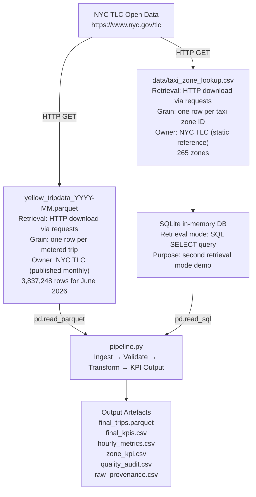
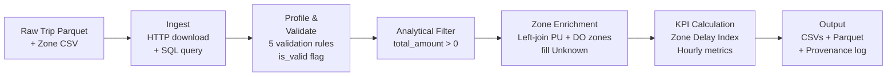
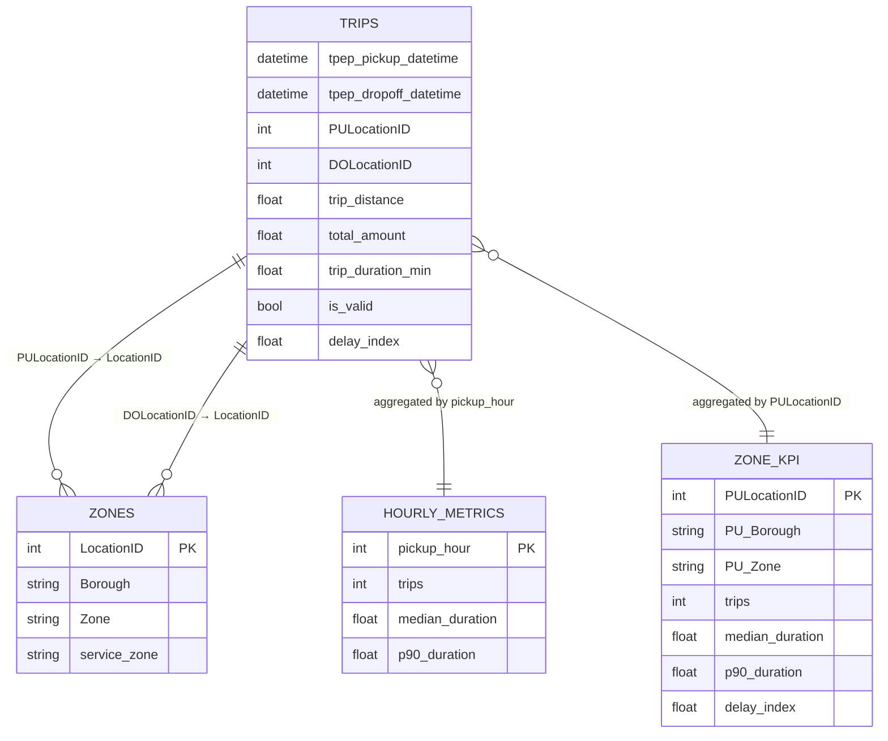
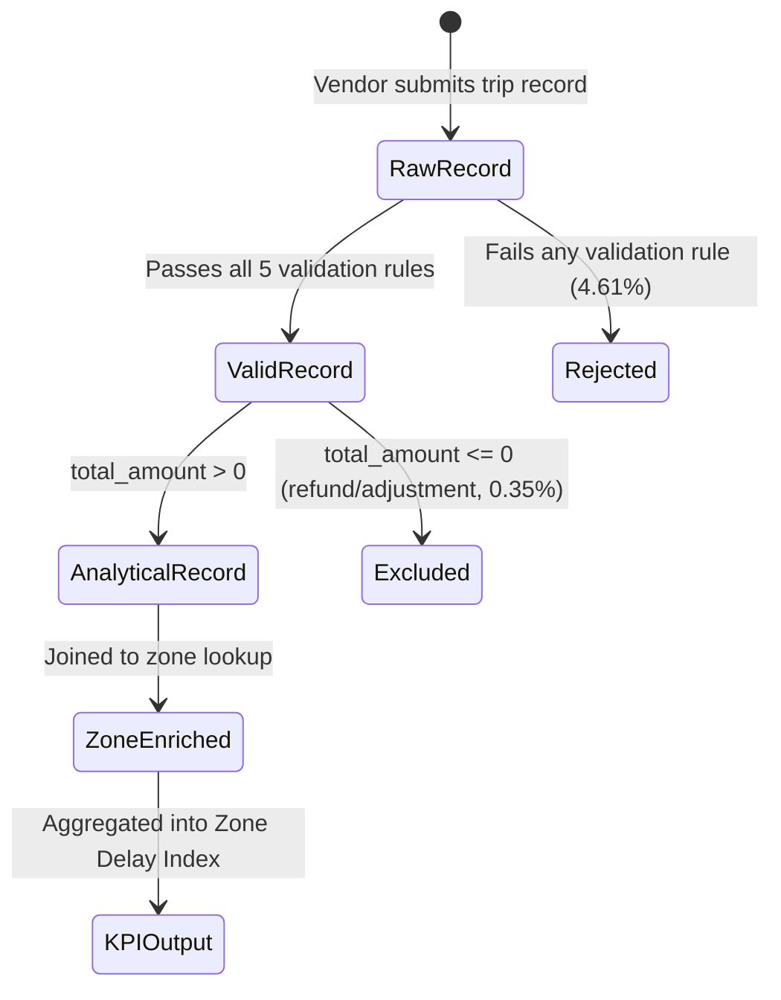

# NYC TLC Yellow Taxi - Zone Trip Duration Delay Analysis

**FDE Data Foundations Assignment 2 | Track B - NYC TLC**

---

## Business Question

> **Which NYC yellow-taxi pickup zones consistently produce longer-than-baseline trip durations, and how severe is the difference relative to the citywide non-airport baseline?**

---

## Users / Stakeholders

| Stakeholder | Interest |
|---|---|
| NYC Taxi & Limousine Commission (TLC) - Operations & Planning | Identifying pickup zones that may warrant further investigation or attention |
| TLC Analytics / Data Governance team | Confirming that the monthly trip dataset meets quality standards before operational use |

---

## Decision Supported

> **Identify pickup zones that warrant further operational investigation based on unusually high trip-duration delay relative to the citywide non-airport baseline.**

This pipeline does **not** claim to diagnose *why* a zone is delayed, nor does it prescribe a specific intervention. It produces a ranked, evidence-based signal for further investigation.

---

## Project KPI

**Zone Delay Index**

```
Zone Delay Index = zone median trip duration (min)
                  ──────────────────────────────────────────────
                  citywide non-airport median trip duration (min)
```

- A value of **1.0** means the zone's median trip duration equals the citywide non-airport norm
- A value of **2.0** means trips from that zone take twice as long as the citywide norm, on average
- Airport zones (JFK, LaGuardia, Newark) are excluded from the baseline and the zone ranking because they represent a categorically different trip type (long-haul, fixed-route)

---

## Final Evidence Table

*Based on June 2026 NYC TLC Yellow Taxi data - 3,647,543 analytical trips*

| # | Metric | Value | Purpose |
|---|---|---|---|
| 1 | **Core Valid Trip Rate** | 95.39% | Data quality gate - confirms pipeline output is trustworthy |
| 2 | **Citywide Non-Airport Median Trip Duration** | 13.60 min | Baseline denominator for the Zone Delay Index |
| 3 | **Zone Delay Index - Highest zone (East Elmhurst)** | **2.36x** | Primary KPI: median duration 32.13 min vs. 13.60 min baseline |
| 4 | **Zone P90 Trip Duration - East Elmhurst** | 56.11 min | Tail severity: worst-decile rider experience in the highest-delay zone |
| 5 | **Peak Demand Hour / Peak Hour Trips** | 18:00 / 231,529 trips | Operational context: flags the hour when demand pressure is highest |

*Full zone rankings available in `zone_kpi.csv` (79 qualifying zones with ≥ 3,000 trips each for June 2026)*

---

## Source Overview

### Source Map



### Source Details

| Source | Owner | Grain | Format | Key Fields | Retrieval Mode |
|---|---|---|---|---|---|
| NYC TLC Yellow Trip Data (monthly) | NYC TLC (public) | 1 row = 1 metered trip | Parquet | pickup/dropoff datetime, location IDs, distance, fare/total amount | HTTP download (requests) |
| NYC TLC Taxi Zone Lookup | NYC TLC (public, static) | 1 row = 1 zone ID | CSV → SQLite | LocationID, Borough, Zone, service_zone | SQL query (sqlite3 in-memory via data/taxi_zone_lookup.csv) |

### Important Source Gaps

- No real-time or near-real-time availability - data is published ~2 months after the trip month
- No driver or vehicle identifiers - cannot attribute patterns to individual drivers or fleets
- No weather, events, or road-condition data - cannot explain *why* a zone has higher delay
- No demand-side data - riders who could not get a taxi are invisible in this dataset

---

## Workflow and Data Model

### Pipeline Workflow



### Data Model (Entity Relationships)



### Trip Lifecycle (Event Model)



---

## Validation Rules

| # | Rule | Logic | Rationale |
|---|---|---|---|
| 1 | Valid pickup date | Pickup within `[month start, month end)` | Exclude stale or misrouted records from other months |
| 2 | Valid timestamp order | Dropoff > Pickup | Negative or zero duration is physically impossible for a completed trip |
| 3 | Valid distance | `trip_distance > 0` | A recorded trip must cover some distance |
| 4 | Valid pickup zone | `PULocationID` in zone lookup | Required for zone enrichment and delay index calculation |
| 5 | Valid dropoff zone | `DOLocationID` in zone lookup | Required for complete trip spatial attribution |

**Combined**: all five rules must be True -> `is_valid = True`

**Additional analytical filter**: `total_amount > 0` - removes 12,932 records interpreted as refund or adjustment entries. Applied after core validation.

---

## Known / Unknown / Assumption / Limitation (KUAL)

| Category | Factor / Condition | Operational Impact & Handling |
|---|---|---|
| **Known** | 4.61% validation failure rate (176,773 rows) | Driven by zero/negative distance (128,106) and duration <= 0 (49,807). Flagged via `is_valid`, not silently dropped. |
| | 12,932 records with `total_amount <= 0` | Secondary billing filter; excluded as non-revenue adjustments, cancellations, or refunds. |
| | 3,654 PU and 3,389 DO zones with missing metadata | LocationID 264/265 ("N/A"); retained in totals with zone filled as "Unknown", excluded from zone rankings. |
| | Zone qualification threshold: >= 3,000 trips | Excludes thin-sample zones so small-number variance does not generate false delay signals (79 zones qualify). |
| **Unknown** | Causal mechanism behind high delay | Telemetry does not record road construction, street-level bottlenecks, route choice, or weather. |
| | Temporal representativeness | Single-month cross-section; cannot determine whether June 2026 patterns persist seasonally. |
| | Delay locus (origin vs en route) | Only origin and destination are recorded; cannot isolate curbside congestion from arterial delay. |
| | Unmet / suppressed rider demand | Potential passengers who failed to hail a cab or abandoned queues are absent from metered records. |
| **Assumption** | `total_amount > 0` isolates completed trips | Positive gross fare reflects completed commercial passenger service rather than an administrative record. |
| | 13.60 min non-airport median is the true baseline | Removing airport trips (JFK, LGA, EWR) prevents long-haul highway runs from inflating the urban benchmark. |
| | Threshold of >= 3,000 trips ensures stability | Operational volume cutoff balancing statistical median stability with broad urban coverage. |
| | Optional field missingness (~26%) is benign | Missing vendor fields (`passenger_count`, `RatecodeID`, surcharges) do not impact duration or spatial metrics. |
| **Limitation** | Single-month observational window (June 2026) | Results cannot be generalized across winter weather, holiday patterns, or citywide grid changes. |
| | Duration conflates distance and congestion | Zones generating longer-distance trips naturally show higher median durations regardless of traffic speed. |
| | Non-causal prioritization index | The Zone Delay Index flags zones for targeted field investigation; it does not prove why delay occurs. |

---

## Repository Structure

```
FDE-ASST2/
├── README.md                     ← Main documentation
├── requirements.txt              ← Python dependencies for pipeline & tests
├── pipeline.py                   ← Root entry point (invokes pipeline.cli)
├── .gitignore                    ← Git exclusion rules for raw data & outputs
│
├── pipeline/                     ← Modular Pipeline Package
│   ├── __init__.py               ← Package initializer
│   ├── ingest.py                 ← HTTP downloads & SQLite zone lookup ingestion
│   ├── validate.py               ← 5 business validation rules & quality tracking
│   ├── transform.py              ← Analytical filter (total_amount > 0) & zone enrichment
│   ├── metrics.py                ← Zone Delay Index, hourly metrics & KPI calculations
│   └── cli.py                    ← Argument parsing, 7 assertions, runner & output saving
├── docs/                         ← Execution Run Logs
│   └── run_logs/
│       └── successful_run.log    ← Real verified June 2026 pipeline execution log
│
├── tests/                        ← Automated Unit Tests
│   └── test_pipeline.py          ← 6 focused tests (validation, filtering, joins, KPIs)
│
├── notebooks/
│   └── NYC_TLC_Analysis.ipynb    ← Exploratory/analytical walkthrough in 11 sections
│
├── data/
│   └── taxi_zone_lookup.csv      ← Zone reference data (static input, committed)
│
├── outputs/                      ← Pre-computed June 2026 committed evidence files
│   ├── final_kpis.csv            ← 11 summary metrics table
│   ├── hourly_metrics.csv        ← Hourly trip volumes and durations
│   ├── zone_kpi.csv              ← Zone Delay Index ranking table
│   ├── quality_audit.csv         ← Data quality audit counts
│   ├── hourly_trip_demand.png    ← Hourly demand distribution chart
│   ├── hourly_duration.png       ← Hourly median vs P90 duration chart
│   └── top_zone_delay_index.png  ← Top 10 high-delay zones chart
│
└── [not committed to GitHub]
    ├── output/YYYY-MM/           ← Dynamic runtime output directory created when running pipeline.py
    ├── final_trips.parquet       ← Large enriched dataset (~88 MB) - generated at runtime
    └── raw/yellow_tripdata_*.parquet ← Raw TLC source file - downloaded at runtime
```

> **Data & Output Conventions**:
> * **Committed Evidence (`outputs/`)**: Contains verified June 2026 result artifacts (CSVs and PNG charts) for direct evaluation without running code.
> * **Runtime Pipeline Output (`output/YYYY-MM/`)**: Default output destination when executing `python pipeline.py`. Files generated here (`final_trips.parquet`, raw source files) are excluded from Git via `.gitignore`.
> * **Exploratory Walkthrough (`notebooks/`)**: The Jupyter notebook provides the detailed step-by-step EDA, data profiling, validation analysis, and operational findings.
> * **Documentation (`docs/`)**: Houses supplementary technical evidence, source mapping, metric definitions, Mermaid diagrams, and real execution run logs.

---

## Setup and Run Instructions

### Requirements

```bash
pip install -r requirements.txt
```

> **Note on notebook vs. pipeline outputs**: The exploratory notebook (`notebooks/NYC_TLC_Analysis.ipynb`) was developed iteratively and produces 10 summary metrics. The standalone `pipeline.py` produces 11 metrics - it adds `Citywide Non-Airport Median Duration` as an explicit row because it is the denominator of the Zone Delay Index and should be surfaced clearly in the output. The validation logic, thresholds, and final analytical row counts are identical between the two.

### Run the pipeline

```bash
# Default: June 2026
python pipeline.py

# Specify a different month
python pipeline.py --year 2026 --month 7

# Skip re-download if raw files already exist locally
python pipeline.py --year 2026 --month 6 --skip-download

# Custom output directory
python pipeline.py --year 2026 --month 6 --output-dir ./results/june-2026
```

### Run unit tests

```bash
pytest -v
```

### What the pipeline does (in order)

1. **Retrieves** the trip Parquet file via HTTP download from the TLC public endpoint (retrieval mode 1)
2. **Retrieves** the zone lookup CSV via HTTP download, then loads it into an in-memory SQLite database and queries it with SQL (retrieval mode 2)
3. **Checks retrieval completeness**: asserts the file covers the target month and is non-empty
4. **Preserves raw inputs**: writes SHA-256 digests of downloaded source files to `raw_provenance.csv` (written only when files are downloaded; skipped with `--skip-download`)
5. **Validates**: applies 5 business-oriented validation rules and logs failure counts per rule
6. **Filters**: removes `total_amount <= 0` records as a secondary analytical filter
7. **Enriches**: joins pickup and drop-off zone metadata; fills unmatched zones as `"Unknown"`
8. **Calculates metrics**: Zone Delay Index, hourly metrics, summary KPIs, quality audit
9. **Asserts integrity**: 7 pipeline assertions with descriptive error messages
10. **Saves outputs**: all CSVs, final Parquet, and provenance log to the output directory

### Expected outputs

```
output/2026-06/
├── final_trips.parquet       ← 3,647,543 rows - enriched analytical dataset
├── final_kpis.csv            ← 11 summary metrics
├── hourly_metrics.csv        ← 24 rows - trips, median, P90 by hour
├── zone_kpi.csv              ← 79 rows - Zone Delay Index by pickup zone (June 2026)
├── quality_audit.csv         ← 7 validation/cleaning counts
└── raw_provenance.csv        ← SHA-256 hashes of raw source files
```

---

## FDE Judgement Call (for demo)

**Why `total_amount > 0` rather than `fare_amount > 0` as the analytical filter?**

`fare_amount` captures only the metered base fare and can be zero or negative in legitimate flat-rate or negotiated-rate trips (e.g., JFK flat fare). `total_amount` reflects the complete economic value of the trip including all surcharges (congestion, airport fee, MTA tax, improvement surcharge). A non-positive `total_amount` is a reliable indicator that the record represents a refund, billing adjustment, or cancellation rather than a completed revenue trip. Using `total_amount > 0` as the filter preserves legitimate low-fare trips while excluding records that are not operationally meaningful.
