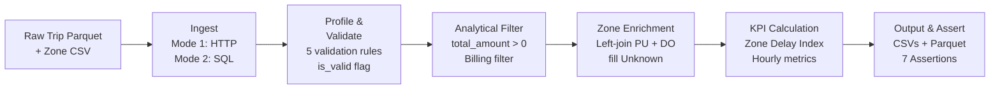
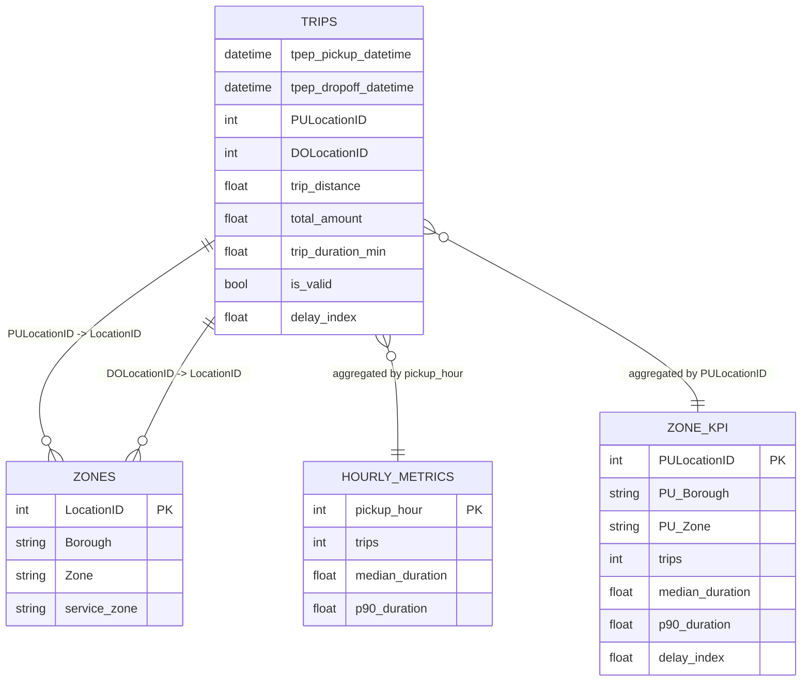
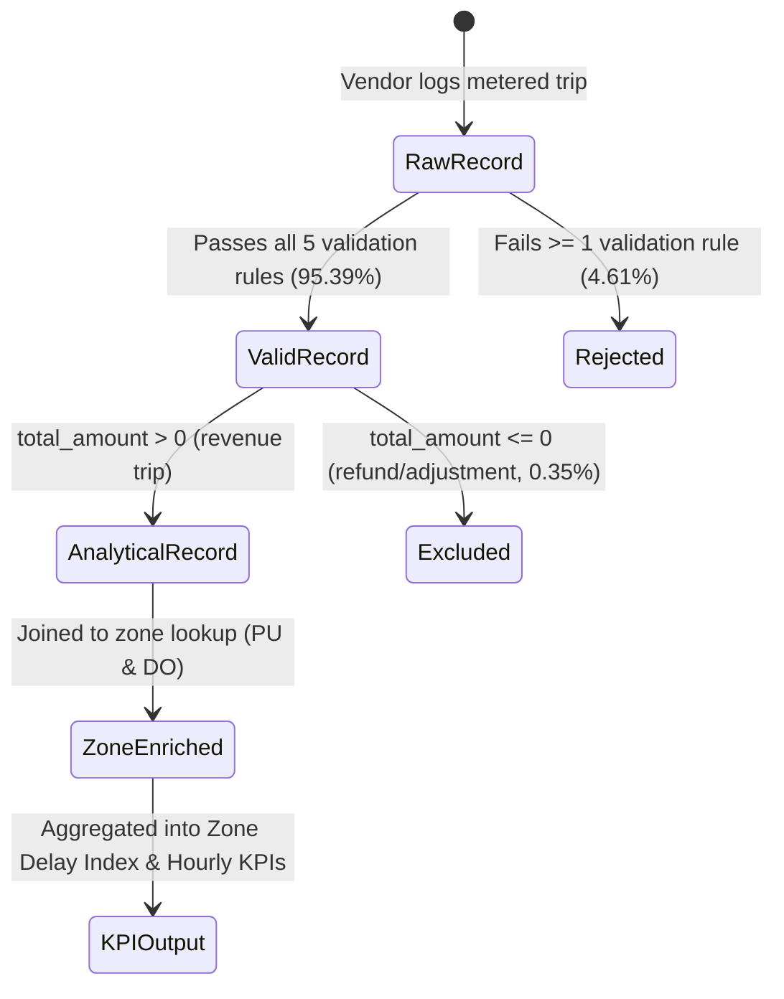

# Workflow and Data Model

## 1. Pipeline Workflow Architecture

The pipeline processes monthly TLC Yellow Taxi trip data through six deterministic stages:

### Stage Summary
1. **Ingest (`pipeline/ingest.py`)**: Retrieves raw monthly parquet via streaming HTTP and loads taxi zone lookup CSV into an in-memory SQLite database, queried via SQL. Completeness checks verify record presence and month boundaries.
2. **Validate (`pipeline/validate.py`)**: Applies five business rules, flagging rows without silent dropping. Computes Core Valid Trip Rate.
3. **Filter (`pipeline/transform.py`)**: Filters out zero or negative `total_amount` records to eliminate non-revenue refunds and billing corrections.
4. **Enrich (`pipeline/transform.py`)**: Merges spatial zone metadata for pickup and drop-off locations (`PU_Zone`, `DO_Zone`). Unmatched or missing metadata is preserved as `"Unknown"`.
5. **KPI Calculation (`pipeline/metrics.py`)**: Calculates baseline non-airport median duration, Zone Delay Index, and hourly trip distributions.
6. **Save & Assert (`pipeline/cli.py`)**: Executes 7 data integrity assertions and writes outputs to disk.

---

## 2. Data Model (Entity Relationship Diagram)

---

## 3. Trip Lifecycle & Event Model

